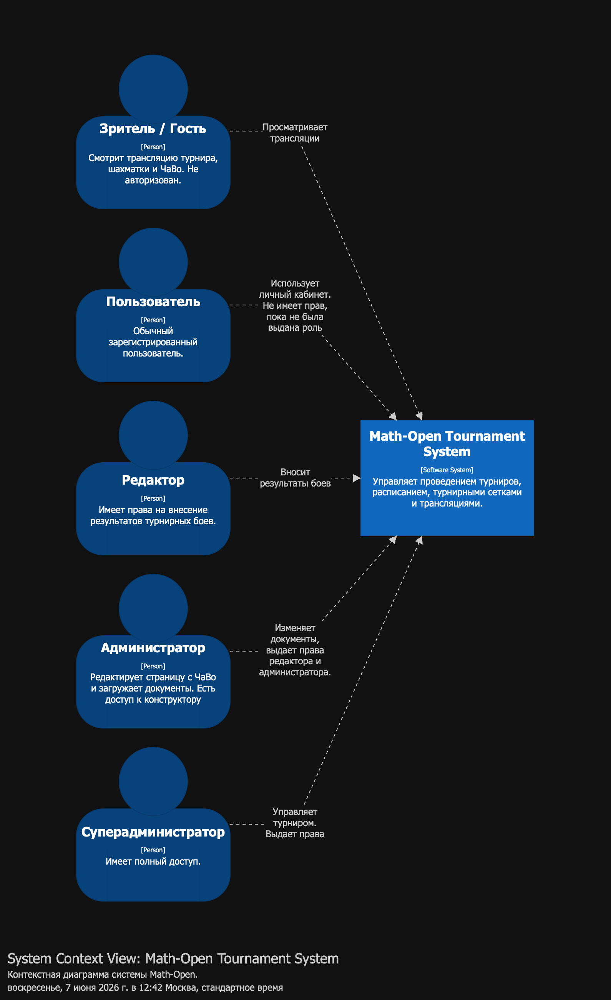
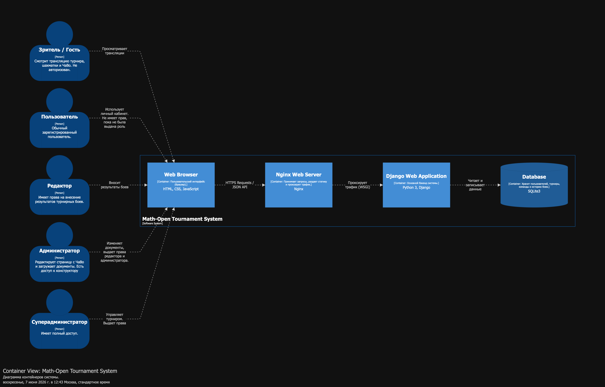
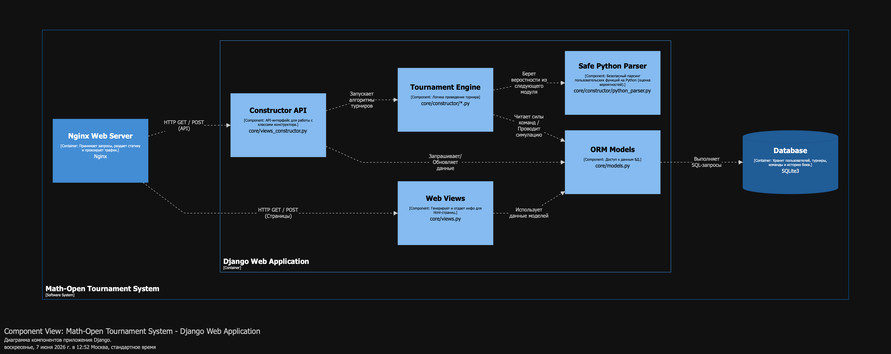

# Руководство разработчика.

## Технологический стек
- **Язык программирования:** Python 3.12
- **Фреймворк:** Django 6.0.2
- **СУБД:** SQLite
- **Контейнеризация и веб-сервер:** Docker, Docker Compose, Nginx, Gunicorn
- **Фронтенд:** HTML5, CSS3, Vanilla JavaScript
- **Анализ данных и симуляции:** NumPy, Pandas

## Context
* **Система**: Math-Open Tournament System (Система для проведения турниров)
* Внешние сущности отсутствуют.



## Containers



## Components



## Инструкция по локальному развертыванию

Проект рекомендуется развертывать при помощи Docker.

1. Создайте конфигурационный файл `.env` в корневой директории проекта и задайте переменные среды:
   ```env
   SECRET_KEY=your_secure_django_key_here
   DEBUG=True
   ALLOWED_HOSTS=127.0.0.1,localhost, {айпи вашего сервера}, {домен сайта}
   ```
2. Выполните сборку и запуск сервисов на сервере:
   ```bash
   docker-compose up -d --build
   ```